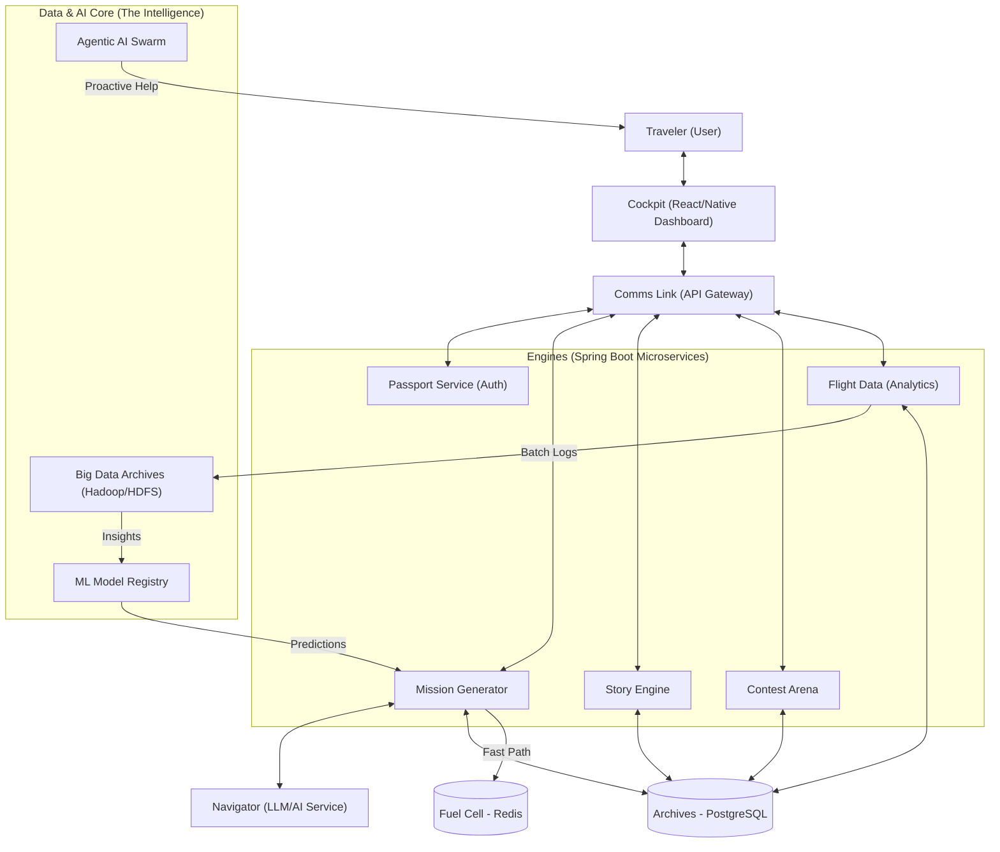

# Design: Learning Galaxy

## Visionary Concept
Imagine a **Learning Galaxy**: every student is a traveler, every subject is a planet, and consistency is the fuel. Aptitude, DSA, math, and physics are destinations they must visit daily. The AI mentor is their navigator, ensuring they don’t drift into the void of inconsistency. Rewards are not just badges — they are powers, tokens, and story unlocks that make the journey joyful.

## System Architecture
The platform follows a microservices architecture to ensure scalability and modularity.

- **Frontend (Cockpit)**: A responsive Web + Mobile dashboard (React/React Native) showing missions, streaks, and rankings through a futuristic "holographic" interface.
- **Backend (Engines)**: Spring Boot microservices handling core logic:
    - **Mission Service**: Daily challenge delivery and validation.
    - **Narrative Service**: Branching logic for the fictional story.
    - **Arena Service**: Real-time WebSocket handlers for competitive matches.
- **AI Layer (Navigator & Agents)**: 
    - **Navigator**: LLM-based navigation (Gemini/OpenAI) for reactive help.
    - **Agentic AI**: Specialized agents that run autonomously to monitor user health, predict stagnation, and "push" notifications or rewards to re-engage the traveler.
- **Data Lake (Hadoop)**: A HDFS-based repository for long-term storage of high-volume telemetry (clickstreams, attempt logs) to be processed for deep ML insights.
- **Database (Archives)**: PostgreSQL for persistent data and Redis for real-time leaderboards.
- **Cloud Deployment (Orbit)**: AWS (EKS for orchestration, RDS for managed DB, S3 for assets).

## Workflow: The Mission Cycle
1. **Initiation**: Student logs in (Space Passport) → receives a tailored "Daily Mission" based on their current "Arc."
2. **Guidance**: AI Navigator provides a briefing using real-life analogies (e.g., explaining Recursion using "Parallel Universes").
3. **Execution**: Student solves the mission (coding or MCQ) → backend validates solution.
4. **Reward**: Upon success, a "Narrative Jump" is triggered, revealing a new chapter of the story and granting "Respect Tokens."
5. **Updates**: Global rankings and streaks are updated in real-time.
6. **Debrief**: Analytics summarize performance and suggest the next destination (Subject Planet).

## Key Modules
- **Mission Generator**: Algorithmically assembles Aptitude, DSA, Math, and Physics challenges.
- **AI Navigator**: Character-driven mentor module that adapts its tone and help level based on user history.
- **Contest Arena**: Elo-based matchmaking for "Dojo" sparring and weekly planetary contests.
- **Gamification Layer**: Manages "Energy Crystals" (re-tries), "Respect Tokens," and unique collectible badges.
- **Narrative Engine**: A content management system for branching scripts and story unlocks.
- **Analytics Dashboard**: Visualizes the "Traveler's Progress" through heatmaps and flight paths.

## Technical Stack Recommendation
| Layer | Technology |
| :--- | :--- |
| **Frontend** | React, Tailwind CSS, Framer Motion (for animations) |
| **Mobile** | React Native / Expo |
| **Backend** | Spring Boot, Java 21 |
| **API** | REST, GraphQL, WebSockets (for Arena) |
| **Database** | PostgreSQL, Redis |
| **AI & ML** | LangChain / Spring AI, TensorFlow/PyTorch (ML Models), LangGraph (Agent Orchestration) |
| **Big Data** | Hadoop HDFS, Spark (for batch processing flight data) |
| **DevOps** | Docker, Kubernetes, GitHub Actions |
